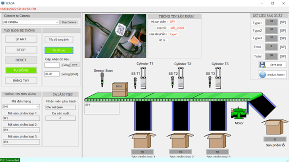

# Product Classification System Using QR Code

## Overview

This project implements a product classification system based on QR codes. Each product has a unique QR code, which is scanned to classify and sort the product into appropriate bins. This system is designed to be used in production lines for sorting components and products before storage or further processing.

## Features

- **Automated and Manual Modes**: The system supports both automatic and manual operation modes for flexibility.
- **SCADA Interface**: A Supervisory Control and Data Acquisition (SCADA) interface is designed using Visual Studio for monitoring and control.
- **PLC Integration**: The system is controlled by a Programmable Logic Controller (PLC) to ensure precise sorting.
- **Real-time Data Processing**: QR codes are scanned, processed, and used to control actuators in real-time.

## System Requirements

- **Power Supply**: 24VDC, 220VAC
- **PLC**: Programmable Logic Controller for control logic
- **Sensors**: Infrared sensors for object detection
- **Actuators**: Cylinders and relays for physical sorting
- **Computer**: For running the SCADA interface and processing QR code data
- **KEPServerEX**: For PLC communication

## Technical Details

### Workflow

1. **QR Code Detection**:
   - The conveyor moves products under a camera.
   - The camera scans the QR code.
   - The QR code is processed using a lib in C# is Zxing

    

2. **Product Sorting**:
   - Based on the QR code, the system determines the correct bin for each product.
   - Actuators (controlled by the PLC) push the product into the correct bin.

    

### QR Code Structure

- **Cells**: Black and white squares representing binary data.
- **Alignment Patterns**: Squares at the corners to help the camera align and read the QR code.
- **Timing Patterns**: Alternating black and white squares to help the system determine the QR code's dimensions.

    

### SCADA Interface

- Developed using Visual Studio and C#.
- Includes menu options for Home, SCADA, Orders, Production Data, Alarms, Trends, Settings, Control, Logout, and Exit.
- Displays real-time data and system status.

    

### Database

- **SQL Server**: Used for storing user information, orders, and production data.
- **Tables**:
  - Users: Stores user account details.
  - Orders: Stores order information.
  - Production Data: Logs production statistics and system performance.

    

## Installation

1. **Setup SQL Server**:
   - Create a new database and tables as specified in the project.
2. **Visual Studio Project**:
   - Open the project in Visual Studio.
   - Ensure all required libraries (like Symbol Factory) are included.
3. **Configure PLC**:
   - Connect the PLC with the computer using KEPServerEX.
   - Ensure all tags for reading and writing data are correctly set up.

## Usage

1. **Start the System**:
   - Power on all components.
   - Open the SCADA interface from the Visual Studio application.
   - Select the operation mode (Auto or Manual).
2. **Monitoring**:
   - Use the SCADA interface to monitor real-time data.
   - Check system logs and production data from the database.

## Contributing

- Fork the repository
- Create a new branch (`git checkout -b feature-foo`)
- Commit your changes (`git commit -am 'Add some feature'`)
- Push to the branch (`git push origin feature-foo`)
- Create a new Pull Request
